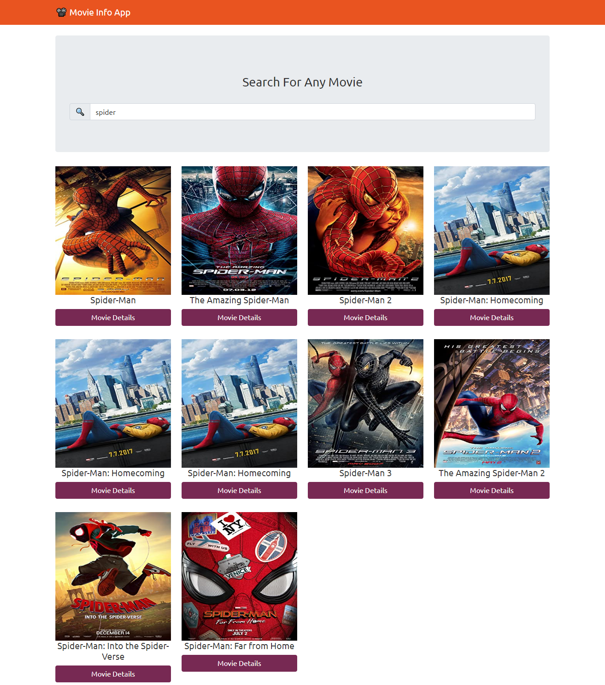
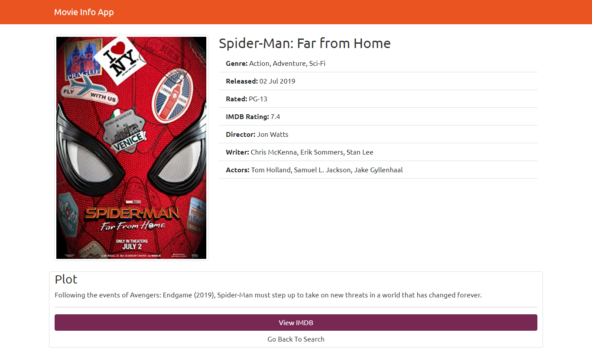

<h2>Movie Info App</h2>

 JavaScript/jQuery Application that Fetches and Displays searched Movie Info using <a href="http://www.omdbapi.com/" target="_blank">OMDB API</a> through Axios.

<h4>Main Page:</h4>

<h4>Movie Info Page:</h4>

<h4>Tech Stack Used:</h4>
<li> JavaScript </li>
<li> Bootstrap 4 <a href="https://bootswatch.com/united/">Theme</a></li>
<li> Axios </li>
<li> <a href="http://www.omdbapi.com/" target="_blank">OMDB API</a> </li>

## Author

You can get in touch with me on my LinkedIn Profile:

#### Gulraiz Noor Bari

 

You can also follow my GitHub Profile to stay updated about my latest projects: 

If you liked the repo then kindly support it by giving it a star ⭐!

## Contributions Welcome

If you find any bug in the code or have any improvements in mind then feel free to generate a pull request.
